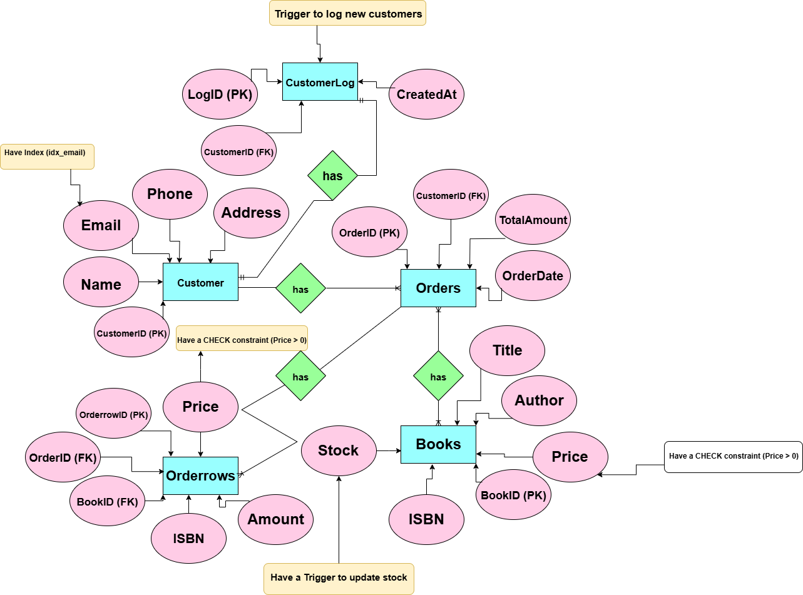

Inlämning 2 - Kurs: Databaser YH2024 - Skapad av: Sandra Bäckström
Detta repository innehåller alla mina filer för inlämningsuppgift 2 i kursen Databaser.

##Beskrivning
Denna databas är skapad för att hantera en liten bokhandel. Den innehåller tabeller för:
*Böcker
*Kunder
*Beställningar
*Orderrader

samt koder för att:
*Hämta, filtrera och sortera data
*Modifiera data
*Join, Group by och Having
*Index, Constraint och Trigger
*Backup

##Innehåll
*inlamning2.sql - En SQL-fil med min exekverbara kod.
*Inlämning2.drawio.png - En bild av ER-diagrammet som visar databasens struktur.

##Instruktioner för användning
Öppna valfri MYSQL-klient.
Kör inlamning2.sql för att skapa och fylla databasen.

##Reflektion
Jag har valt att skapa en databas som följer en relationsmodell för att säkerställa dataintegritet, konsekvens och effektivitet. Strukturen består av flera tabeller med väldefinierade relationer:

*Kunder lagrar personlig information unikt identifierad av kund-ID.
*Böcker innehåller information om tillgängliga produkter med BookID som Primary Key.
*Beställningar representerar köp, länkar till kund-ID.
*Orderrader associerar böcker med beställningar, vilket säkerställer att flera böcker kan ingå i ett enda köp.

Denna struktur undviker möjliggör effektiv hämtning och hantering av poster.
Om jag skulle designa om den här databasen kan jag överväga följande förbättringar:

*Separat adressinformation: Istället för att lagra hela adressen i ett enda fält, kan en separat tabell för adresser (AddressID) användas för att tillåta flera kunder att dela adresser.
*Transaktionstabell: En separat transaktionstabell kan skapas för att spåra betalningar oberoende av order, vilket ger bättre ekonomisk spårning.

Att hantera 10 000 kunder introducerar utmaningar relaterade till prestanda, indexering och lagring. Följande ändringar skulle behövas:

*Indexoptimering:
Lägg till ett index på e-post i kundtabellen för att snabba på frågor.
Indexera ofta sökta kolumner som Titel i böcker och Orderdatum i beställningar.

*Uppdelning:
Dela upp stora tabeller (ordrar och orderrader) efter OrderDate för att förbättra frågeeffektiviteten.

*Hybridlösning:
Att kombinera en SQL-databas med en NoSQL-databas och göra en hybridlösning kan vara effektivt för att hantera en större mängd data, som till exempel att hantera 10 000 kunder. Man behöver dock tänka på datasäkerhet och då är inte en NoSQL-databas det bästa alternativet. Om man däremot utökade sitt utbud av produkter, till exempel ha fler boktitlar, så skulle en NoSQL-databas fungera. 

##Slutsats
Denna databas är designad för datakonsistens, integritet och flexibilitet. Men för storskalig distribution (10 000+ kunder) blir indexering och uppdelning. Genom att implementera dessa optimeringar kan databasen hantera tillväxt effektivt med bibehållen hög prestanda och tillförlitlighet.

